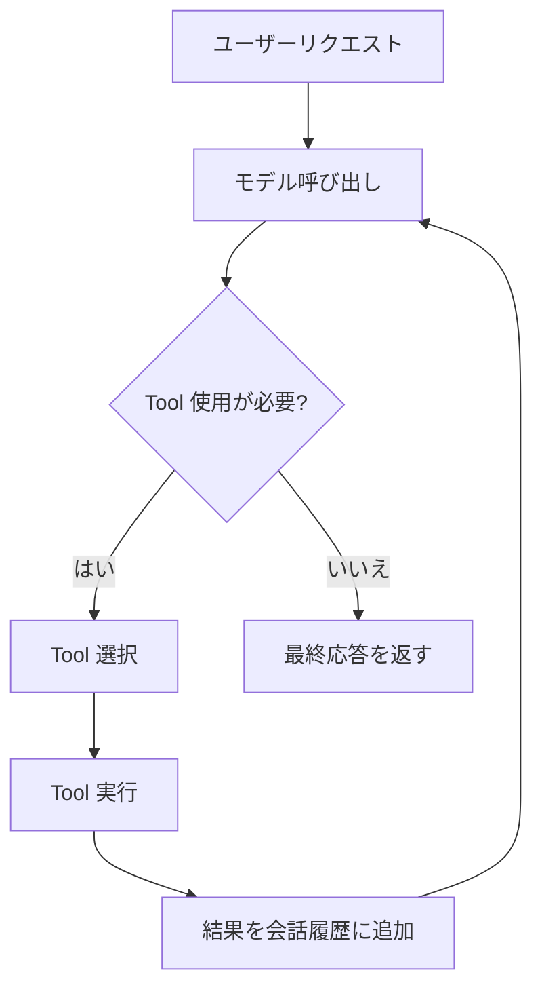

# Agent Loop

> 原文: https://strandsagents.com/latest/documentation/docs/user-guide/concepts/agents/agent-loop/

## 目次

- [Agent Loop](#agent-loop)
  - [目次](#目次)
  - [Agent Loop とは](#agent-loop-とは)
  - [ループの仕組み](#ループの仕組み)
  - [具体的な例](#具体的な例)
  - [メッセージと会話履歴](#メッセージと会話履歴)
  - [Tool の実行](#tool-の実行)
  - [ループのライフサイクル](#ループのライフサイクル)
    - [ループの開始](#ループの開始)
    - [停止理由](#停止理由)
    - [ループの拡張](#ループの拡張)
  - [よくある問題](#よくある問題)
    - [コンテキストウィンドウの枯渇](#コンテキストウィンドウの枯渇)
    - [不適切な Tool 選択](#不適切な-tool-選択)
    - [MaxTokensReachedException](#maxtokensreachedexception)
  - [次のステップ](#次のステップ)

---

## Agent Loop とは

言語モデルは質問に答えることができる。Agent は**物事を実行**できる。Agent Loop がこの違いを可能にする。

モデルがトレーニングだけでは完全に対処できないリクエストを受け取った場合、外部にアクセスする必要がある：ファイルの読み取り、データベースのクエリ、API の呼び出し、コードの実行など。Agent Loop は、このようなアクションを可能にするオーケストレーション層である。複数のステップ、外部情報、または実世界の副作用を必要とする問題に対処するための、推論と行動のサイクルを管理する。

これは Strands の基本的な概念であり、他のすべてはこの上に構築される。

## ループの仕組み

Agent Loop は単純な原則で動作する：モデルを呼び出し、Tool を使用したいかどうかを確認し、使用したい場合は Tool を実行し、結果を持ってモデルを再度呼び出す。モデルが最終的な応答を生成するまでこれを繰り返す。

この図は、ループの中心にある再帰的な構造を示している。モデルが推論し、Tool を選択し、Tool が実行され、結果がモデルにフィードバックされて次の推論ラウンドが行われる。このサイクルは、モデルが応答するのに十分な情報があると判断するまで続く。

これが強力な理由は、コンテキストの蓄積にある。ループの各反復で会話履歴にメッセージが追加される。モデルは元のリクエストだけでなく、呼び出したすべての Tool とその結果も見ることができる。この蓄積されたコンテキストにより、洗練されたマルチステップの推論が可能になる。

## 具体的な例

コードベースのセキュリティ脆弱性を分析するリクエストを考えてみよう。これはモデルが記憶だけでできることではない。ファイルを読み取り、コードを検索し、発見を統合できる Agent が必要である。Agent Loop は連続した反復を通じてこれを処理する：

1. モデルは分析リクエストを受け取る。まず構造を理解する必要がある。リポジトリのルートを入力としてファイル一覧 Tool をリクエストする。

2. モデルはコンテキスト内にディレクトリ構造を見る。メインのアプリケーションエントリポイントを識別し、それを調べるためにファイル読み取り Tool をリクエストする。

3. モデルはアプリケーションコードを見る。データベースクエリに気づき、SQL インジェクションの可能性についてデータベースモジュールを調べることにする。再度ファイル読み取りをリクエストする。

4. モデルはデータベースモジュールを見て、脆弱性を識別する：ユーザー入力が直接 SQL クエリに連結されている。範囲を評価するため、脆弱な関数のすべての呼び出し箇所を見つけるコード検索 Tool をリクエストする。

5. モデルは検索結果に 12 箇所の呼び出しを見つける。これで必要なものがすべて揃った。別の Tool をリクエストする代わりに、最終応答を生成する：脆弱性の詳細、影響を受ける場所、修正手順を含むレポート。

各反復は同じパターンに従った。モデルはコンテキストを受け取り、行動するか応答するかを決定し、ループを続けるか終了した。重要な洞察は、モデルがタスクへの理解の進化に基づいてこれらの決定を自律的に行ったことである。

## メッセージと会話履歴

メッセージは Agent Loop を通じて 2 つのロールで流れる：user と assistant。各メッセージには異なる形式のコンテンツが含まれる。

**User メッセージ**には、最初のリクエストとフォローアップの指示が含まれる。User メッセージのコンテンツには以下が含まれる：

- ユーザーからのテキスト入力
- 以前の Tool 実行からの Tool 結果
- ファイル、画像、音声、動画などのメディア

**Assistant メッセージ**はモデルの出力である。Assistant メッセージのコンテンツには以下が含まれる：

- ユーザーへのテキスト応答
- 実行システムへの Tool 使用リクエスト
- 推論トレース（モデルがサポートしている場合）

会話履歴は、ループの反復全体で 3 種類のメッセージすべてを蓄積する。この履歴はタスクのためのモデルの作業メモリである。Conversation Manager は、最も関連性の高い情報を保持しながら、この履歴をモデルのコンテキストウィンドウ内に収める戦略を適用する。利用可能な戦略の詳細については、[Conversation Management](./07-conversation-management.md) を参照。

## Tool の実行

モデルが Tool をリクエストすると、実行システムは以下を行う：

1. Tool のスキーマに対してリクエストを検証
2. レジストリで Tool を見つける
3. エラーハンドリング付きで Tool を実行
4. 結果を Tool 結果メッセージとしてフォーマット

実行システムは成功した結果と失敗の両方をキャプチャする。Tool が失敗した場合、ループを終了する例外をスローする代わりに、エラー情報がエラー結果としてモデルに戻される。これにより、モデルは回復または代替を試みる機会を得る。

## ループのライフサイクル

Agent Loop には明確に定義された開始点と終了点がある。これらを理解することで、Agent の動作を予測し、エッジケースを処理できる。

### ループの開始

Agent がリクエストを受け取ると、Tool の登録、Conversation Manager のセットアップ、メトリクス収集の準備を行って初期化する。ユーザーの入力は会話履歴の最初のメッセージになり、ループは最初の反復を開始する。

### 停止理由

各モデル呼び出しは、次に何が起こるかを決定する停止理由で終了する：

- **End turn**: モデルは応答を完了し、これ以上のアクションを取る必要がない。これは通常の正常終了である。ループは終了し、モデルの最終メッセージを返す。

- **Tool use**: モデルは続行する前に 1 つ以上の Tool を実行したい。ループはリクエストされた Tool を実行し、結果を会話履歴に追加し、モデルを再度呼び出す。

- **Max tokens**: トークン制限に達したため、モデルの応答が切り捨てられた。これは現在のループ内では回復不可能である。モデルは部分的な応答から続行できず、ループはエラーで終了する。

- **Stop sequence**: モデルが設定された停止シーケンスに遭遇した。End turn と同様に、ループは正常に終了する。

- **Content filtered**: 応答が安全性メカニズムによってブロックされた。

- **Guardrail intervention**: ガードレールポリシーが生成を停止した。

Content filtered と Guardrail intervention の両方がループを終了し、アプリケーションの要件に従って処理する必要がある。

### ループの拡張

Agent は主要なポイントでライフサイクルイベントを発行する：各呼び出しの前後、各モデル呼び出しの前後、各 Tool 実行の前後。これらのイベントにより、コアループロジックを変更せずに、観測、メトリクス収集、動作の変更が可能になる。これらのイベントの購読の詳細については、[Hooks](./05-hooks.md) を参照。

## よくある問題

### コンテキストウィンドウの枯渇

各ループ反復で会話履歴にメッセージが追加される。多くの Tool 呼び出しを必要とする複雑なタスクでは、この履歴がモデルのコンテキストウィンドウを超える可能性がある。これが発生すると、Agent は続行できない。

症状には、入力の長さに関するモデルプロバイダーからのエラー、または関連性の低い以前のメッセージでコンテキストが埋まるにつれてモデルのパフォーマンスが低下することが含まれる。

**解決策：**

- Tool 出力の冗長性を減らす。完全なデータではなく、要約または関連する抜粋を返す。
- Tool スキーマを簡素化する。深くネストされたスキーマは、Tool 設定とモデルの推論の両方でトークンを消費する。
- 適切な戦略で Conversation Manager を設定する。デフォルトのスライディングウィンドウ戦略は多くのアプリケーションで機能するが、長時間実行されるタスクには要約またはカスタムアプローチが必要な場合がある。利用可能なオプションについては、[Conversation Management](./07-conversation-management.md) を参照。
- 大きなタスクをサブタスクに分解し、それぞれを新しいコンテキストで処理する。

### 不適切な Tool 選択

モデルが一貫して間違った Tool を選択する場合、問題は通常、曖昧な Tool の説明にある。モデルの観点から説明を見直す。2 つの Tool に重複する説明がある場合、モデルにはそれらを選択する根拠がない。効果的な説明の書き方については、[Tools Overview](../02-tools/01-tools-overview.md) を参照。

### MaxTokensReachedException

モデルの応答が設定されたトークン制限を超えると、ループは `MaxTokensReachedException` を発生させる。これは通常、以下の場合に発生する：

- モデルが異常に長い応答を生成しようとしている
- コンテキストウィンドウがほぼいっぱいで、応答のための十分なスペースがない
- Tool の結果が会話をトークン制限近くまで押し上げている

この例外は、コンテキストサイズを減らすか、トークン制限を増やすか、タスクを小さなステップに分割することで処理する。

## 次のステップ

Agent Loop は実行プリミティブである。上位レベルのパターンはその上に構築される：

- [Conversation Management](./07-conversation-management.md) - 一貫した長時間のインタラクションを維持する戦略
- [Hooks](./05-hooks.md) - Agent の動作を観測、変更、拡張する
- マルチエージェントアーキテクチャ - 共有 Tool またはメッセージパッシングを通じて Agent が調整する
- 評価フレームワーク - 複雑なタスクでの Agent パフォーマンスを評価する

ループを深く理解することで、これらの高度なパターンがより理解しやすくなる。同じ原則がすべてのレベルで適用される：明確な Tool 契約、蓄積されたコンテキスト、定義された境界内での自律的な意思決定。
