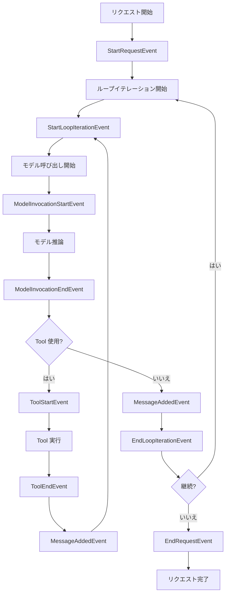

# Hooks

> 原文: https://strandsagents.com/latest/documentation/docs/user-guide/concepts/agents/hooks/

## 目次

- [概要](#概要)
- [利用可能な Hook イベント](#利用可能な-hook-イベント)
- [Hook の登録](#hook-の登録)
- [ユースケース](#ユースケース)
- [Hook 実行のフロー](#hook-実行のフロー)

---

> **Note**: Hook は現在 TypeScript SDK ではサポートされていないが、近日対応予定。

## 概要

Strands Agents は、Hook を通じて堅牢なイベントシステムを提供する。これにより、開発者は Agent の実行の様々なポイントでカスタム動作を挿入できる。Hook を使用すると、コアな Agent ロジックを変更せずに、Agent ライフサイクルのすべてのステップを観察、カスタマイズ、および拡張できる。

Hook を登録すると、`HookRegistry` がすべてのフックコールバックを管理し、イベントがトリガーされたときにフックが呼び出されることを保証する。

## 利用可能な Hook イベント

Strands は、Agent 実行のさまざまなポイントをキャプチャする複数の Hook イベントを提供する。各イベントクラスは `strands.hooks.events` からインポートできる。

| イベント | 説明 |
|--------|------|
| `StartRequestEvent` | 新しいリクエストが開始されたときにトリガー |
| `StartLoopIterationEvent` | 各ループイテレーションの開始時にトリガー |
| `MessageAddedEvent` | 会話にメッセージが追加されたときにトリガー |
| `ModelInvocationStartEvent` | モデル推論が開始されたときにトリガー |
| `ModelInvocationEndEvent` | モデル推論が完了したときにトリガー |
| `ToolStartEvent` | Tool の実行が開始されたときにトリガー |
| `ToolEndEvent` | Tool の実行が完了したときにトリガー |
| `EndLoopIterationEvent` | 各ループイテレーションの終了時にトリガー |
| `EndRequestEvent` | 完全なリクエストが完了したときにトリガー |

## Hook の登録

Hook の登録には 2 つの方法がある：`@hook` デコレーターを使用するか、`HookRegistry.add_callback` を使用する。

### デコレーターを使用

```python
from strands import Agent
from strands.hooks import hook
from strands.hooks.events import MessageAddedEvent

agent = Agent()

# Agent のデフォルトの hook_registry にデコレーターを渡す
@hook(agent.hook_registry)
def my_function(event: MessageAddedEvent):
    print(event.message)

agent("Hello, world!")
```

> **Note**: `@hook` デコレーターはイベントクラス引数を取るオプションもある。例：`@hook(registry, event_types=[MessageAddedEvent])`。引数として何も渡さない場合、すべてのイベントに対してコールバックが呼び出される。

### add_callback メソッドを使用

```python
from strands import Agent
from strands.hooks.events import StartRequestEvent

agent = Agent()

def my_function(event: StartRequestEvent):
    print("Request starting!")

# すべてのイベントにフックを登録
agent.hook_registry.add_callback(my_function)

# または特定のイベントタイプに登録
agent.hook_registry.add_callback(my_function, event_types=[StartRequestEvent])
```

## ユースケース

### 監査とロギング

Tool の呼び出しをログに記録して、どの Tool がいつ、どんなパラメータで使用されているかを追跡する。これはコンプライアンス目的や Agent の動作のデバッグに不可欠。

```python
import logging
from strands import Agent
from strands.hooks import hook
from strands.hooks.events import ToolStartEvent

agent = Agent()

@hook(agent.hook_registry)
def track_tool_calls(event: ToolStartEvent):
    # Tool 呼び出しをログに記録
    logging.info(f"Tool called: {event.tool_name}")
    logging.info(f"Parameters: {event.tool_input}")
    logging.info(f"Timestamp: {datetime.now().isoformat()}")

agent("Search for the latest AI news and summarize it")
```

### レート制限

API 呼び出しにレート制限を実装して、外部サービスの過負荷を防ぎ、使用制限内に収める。

```python
import time
from collections import defaultdict
from strands import Agent
from strands.hooks import hook
from strands.hooks.events import ToolStartEvent

agent = Agent()

tool_call_times = defaultdict(list)

@hook(agent.hook_registry)
def rate_limit_tools(event: ToolStartEvent):
    tool_name = event.tool_name
    current_time = time.time()
    
    # 過去1分以内の呼び出しを取得
    recent_calls = [t for t in tool_call_times[tool_name] if current_time - t < 60]
    tool_call_times[tool_name] = recent_calls
    
    # 分あたり5回の呼び出しに制限
    if len(recent_calls) >= 5:
        wait_time = 60 - (current_time - recent_calls[0])
        print(f"Rate limit reached for {tool_name}, waiting {wait_time:.0f}s")
        time.sleep(wait_time)
    
    tool_call_times[tool_name].append(current_time)
```

### リソースのクリーンアップ

各会話または操作の終了時にリソースをクリーンアップして、リソースリークを防ぎ、適切なリソース管理を保証する。

```python
from strands import Agent
from strands.hooks import hook
from strands.hooks.events import EndRequestEvent

agent = Agent()

@hook(agent.hook_registry)
def cleanup_resources(event: EndRequestEvent):
    # リクエスト中に取得したリソースをクリーンアップ
    # 例：一時ファイル、データベース接続、キャッシュなど
    cleanup_temp_files()
    close_database_connections()
    clear_request_cache()
```

### メトリクス収集

Agent 操作のメトリクスを収集して、パフォーマンスのボトルネックを特定し、Agent の動作パターンを理解し、重要なパフォーマンス指標を追跡する。

```python
import time
from strands import Agent
from strands.hooks import hook
from strands.hooks.events import (
    StartRequestEvent,
    ModelInvocationStartEvent,
    ModelInvocationEndEvent,
    ToolStartEvent,
    ToolEndEvent,
    EndRequestEvent
)

agent = Agent()
metrics = {"model_calls": 0, "tool_calls": 0, "total_duration": 0}
start_time = None

@hook(agent.hook_registry)
def collect_metrics(event):
    global start_time
    
    if isinstance(event, StartRequestEvent):
        start_time = time.time()
    elif isinstance(event, ModelInvocationEndEvent):
        metrics["model_calls"] += 1
    elif isinstance(event, ToolEndEvent):
        metrics["tool_calls"] += 1
    elif isinstance(event, EndRequestEvent):
        metrics["total_duration"] = time.time() - start_time

agent("Analyze the weather data and create a report")
print(f"Metrics: {metrics}")
```

## Hook 実行のフロー

以下のダイアグラムは、Agent のリクエスト実行中に Hook がどのタイミングで発火するかを示している：



このダイアグラムは、Agent 実行の主要なポイントで Hook がどのようにトリガーされるかを示している。各イベントは、Agent の動作を観察、修正、または拡張する機会を提供する。
